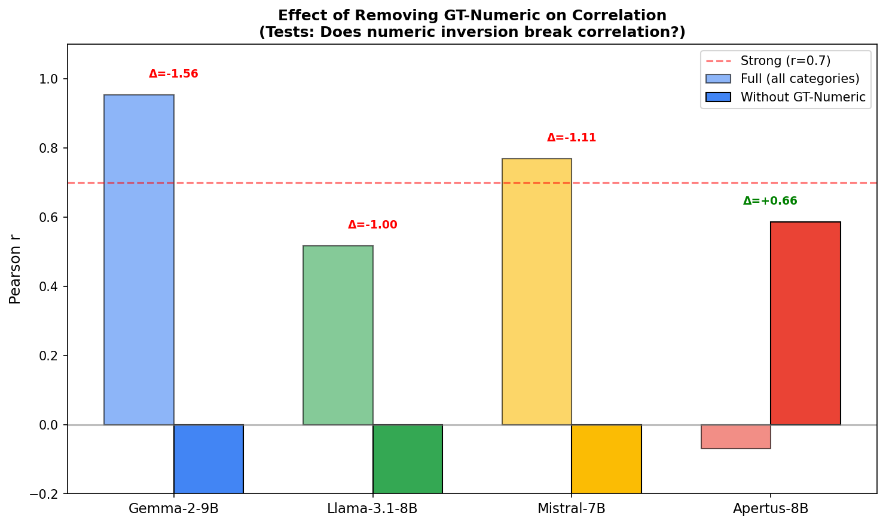
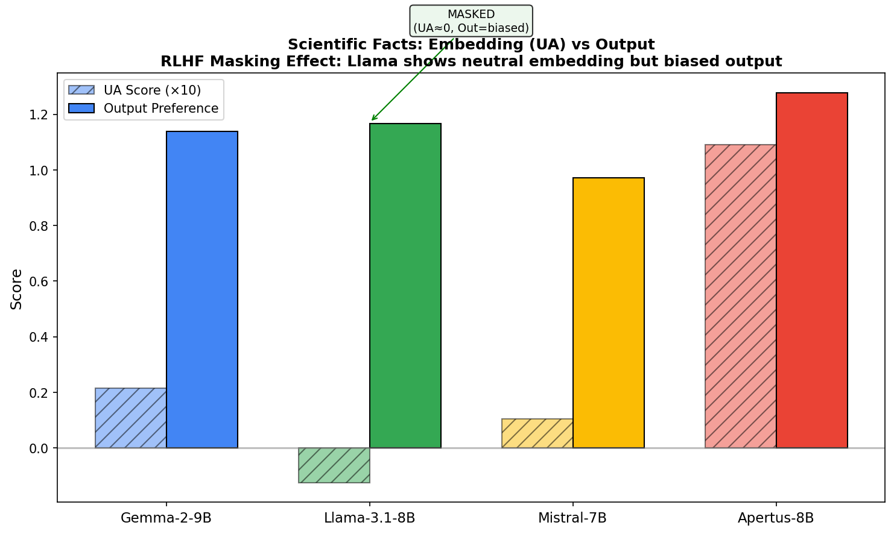
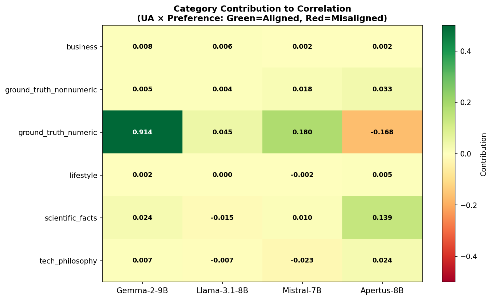
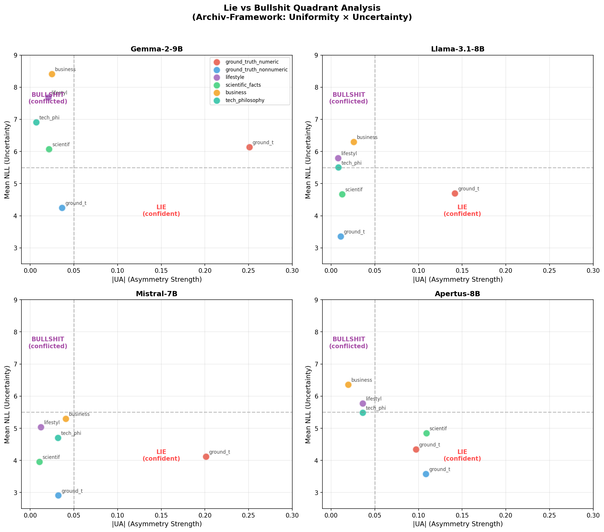

# Extended Results: Output Correlation Analysis

**Version:** v1.1-preliminary
**Date:** 2026-01-01
**Status:** Post-paper validation experiments

---

## Overview

This folder contains validation experiments performed **after** the main paper was written. These results test whether Uniformity Asymmetry (UA) correlates with model output preferences.

**Start here:** [FINDINGS_SUMMARY.md](FINDINGS_SUMMARY.md)

---

## Key Discoveries

| # | Finding | Significance |
|---|---------|--------------|
| 1 | Gemma r=0.95 is artifact of GT-Numeric | Single category drives all correlation |
| 2 | RLHF creates "Deceptive Alignment" | Embeddings neutralized but outputs biased |
| 3 | Multilingual inversion in Apertus | Concept compression vs. output precision |
| 4 | Lie vs Bullshit classification | Categories cluster by confidence × asymmetry |

---

## Directory Structure

```
extended_results/
│
├── FINDINGS_SUMMARY.md          ← START HERE (Executive Summary)
├── README.md                    ← This file
│
├── data/                        ← Raw data (JSON, CSV)
│   ├── correlation_analysis.json
│   ├── contribution_by_category.csv
│   ├── cross_model_divergence.csv
│   └── category_classification.csv
│
├── figures/                     ← Visualizations
│   ├── fig1_correlation_collapse.png
│   ├── fig2_rlhf_masking.png
│   ├── fig3_contribution_heatmap.png
│   ├── fig4_category_quadrants.png
│   └── fig5_rlhf_divergence_detail.png
│
├── provenance/                  ← Bitcoin timestamp proof
│   └── v2_findings_20260101.tar.gz.ots
│
└── methodology/                 ← Full technical details
    └── FULL_ANALYSIS.md
```

---

## Figures

### Figure 1: Correlation Collapse

*Removing GT-Numeric causes correlation to collapse (Gemma) or emerge (Apertus)*

### Figure 2: RLHF Masking

*Llama shows neutral embeddings but biased outputs*

### Figure 3: Contribution Heatmap

*GT-Numeric dominates Gemma's correlation (95% contribution)*

### Figure 4: Category Quadrants

*Lie (confident) vs Bullshit (uncertain) framework*

---

## Data Dictionary

### correlation_analysis.json
```json
{
  "numeric_split": {
    "gemma": {
      "full_r": 0.953,           // Correlation with all categories
      "r_without_numeric": -0.608, // Correlation excluding GT-Numeric
      "delta_r": -1.56           // Change when removing GT-Numeric
    }
  },
  "rlhf_masking": {
    "llama": {
      "ua": -0.013,              // Embedding asymmetry (neutral)
      "pref": 1.17,              // Output preference (biased)
      "interpretation": "MASKED"
    }
  }
}
```

### contribution_by_category.csv
| Column | Description |
|--------|-------------|
| model | Model name (gemma, llama, mistral, apertus) |
| category | Dataset category |
| ua | Uniformity Asymmetry score |
| preference | Output preference (NLL difference) |
| contribution | Contribution to overall correlation |
| aligned | Whether embedding and output agree |

---

## Provenance

These results are timestamped on the Bitcoin blockchain via OpenTimestamps.

**Verify:**
```bash
pip install opentimestamps-client
ots verify provenance/v2_findings_20260101.tar.gz.ots
```

**Hash:** `5520612f4ba370c098caf954f9a03a1f324cdb39ffe102461acfd57a48ad7bfb`

---

## Relationship to Main Paper

| Paper Statement | Extended Results |
|-----------------|------------------|
| "Exploratory metric" | ✅ Confirmed (correlation is category-dependent) |
| "Structural confound" caveat | ✅ Confirmed (GT-Numeric is structural outlier) |
| Apertus shows anomaly | ✅ Explained (Representational Necessity) |
| "No output comparison" limitation | ✅ Now addressed |

**Conclusion:** The paper's cautious framing was correct. These results complement without contradicting.

---

## Citation

```bibtex
@misc{delia2026uniformity_extended,
  author = {D'Elia, Davide},
  title = {Uniformity Asymmetry: Extended Results - Output Correlation Analysis},
  year = {2026},
  publisher = {GitHub/Zenodo},
  howpublished = {\url{https://github.com/buk81/uniformity-asymmetry/tree/main/extended_results}}
}
```

---

## License

MIT License (same as main repository)
